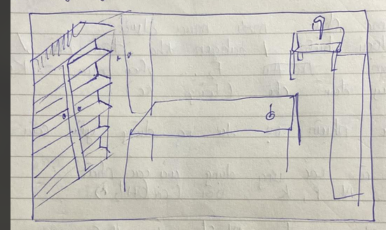

Cơ chế đơn giản bao gồm các tính năng của game :
giao tiếp với npc để nhận nhiệm vụ, nhận nhiệm vụ được tiền và exp để lên cấp
lên cấp mở khóa được thêm các dụng cụ và hóa chất, mở khóa thêm các công thức điều chế hóa chất
- với các việc chính tại phòng lab :

+ bên trái là tủ hóa chất, nhấn vào để mở tủ và chọn/ lấy hóa chất ra- có thể lấy và chia nhỏ ra cho các phản ứng cần số lượng khác nhau- hiển thị số dư <gam> khả dụng để tham gia phản ứng
+bên phải là tủ bao gồm các loại bình- dụng cụ cho các thí nghiệm phản ứng
+đằng sau là bồn rửa, sau mỗi phản ứng cần thu lại chất và rửa sạch ống nghiệm
+ chính giữa là bàn thí nghiệm - sẽ bao gồm các hóa chất- dụng cụ đã được lấy ra từ user
di chuyển các hóa chất/ bình đựng vào nhau để đổ vào nhau, nhấn giữ là đổ từ từ để các chất phản ứng
- đảm bảo màu sắc , tính chất, sản phẩm ra đều đúng với thực tế học thuật
- dung dịch đổi màu, nổi khí, kết tủa, nóng, lạnh đểu phải có 
- sau khi phản ứng xong có thể đổ lại vào các ống / hộp lưu trữ để cất mà mang dụng cụ đi rửa