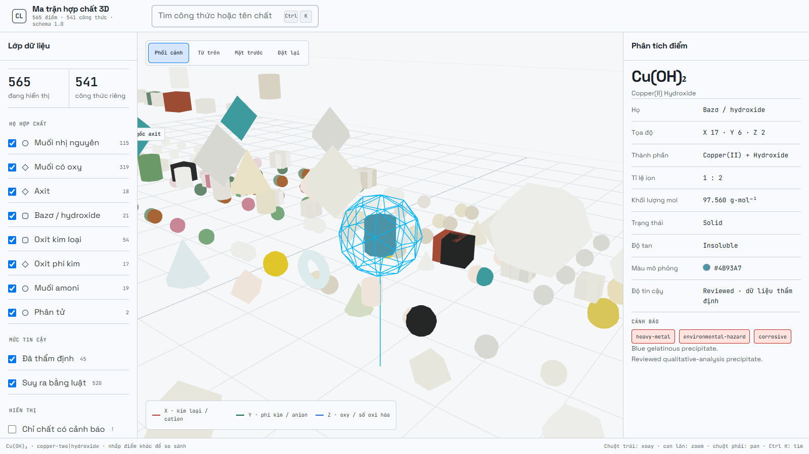

# Chemistry Lab 3D

[](https://github.com/psy-zney/chemistryLAB/actions/workflows/deploy-docs-pages.yml)

Chemistry Lab 3D is a native Unity/C# desktop game. It is not a web build. The current production project is `NativeChemistryLab`, a Windows-focused first-person chemistry laboratory where the player walks around a 3D room, picks chemicals, loads vessels, observes reactions, and sees safety consequences when hazardous gases are handled incorrectly.

The game is built as an educational simulation, not as real laboratory operating guidance.

## Current Feature Set

- Native Unity 6 desktop project using C#.
- First-person 3D laboratory with chemist hands, WASD movement, mouse look, sprint FOV, camera bob, interactable shelves, fume hood, workbench, sink, analysis bench, periodic table, and safety equipment.
- 52 high-school-relevant periodic elements with physical and chemical descriptions.
- 40 catalogued chemicals with phase, model type, color, molar mass, density, melting point, boiling point, appearance, solubility, hazards, handling notes, and common use.
- 38 curated reactions with equations, stoichiometry, product colors, yield estimates, observations, disposal notes, effects, and fume hood requirements.
- Data-driven compound-generation matrix with 27 high-school element nodes, 46 common ions, 565 accepted coordinates representing 541 unique formulas, 45 reviewed property overrides, and explicit rejection rules for unstable combinations.
- Dynamic reaction engine that keeps curated reactions authoritative, then derives additional valid reactions from ion/species rules and asks the compound matrix for charge-balanced formulas, solubility, color, hazards, and confidence.
- 9 dynamic reaction rule families covering acid/base, carbonate, bicarbonate, sulfide, ammonium/base, precipitation, metal displacement, metal/acid, and basic oxide/acid reactions.
- Reaction-condition engine with independent vessel temperature and volume, molar concentration, acid/base-equivalent pH, catalyst requirements, rate classes, completion-time estimates, condition-dependent yield, and explicit blocked outcomes.
- 8 oxidation-reduction rules validated by electron least-common-multiple balancing, including acidic permanganate chemistry and concentration-dependent `Cu + HNO3` products.
- Persistent synthesized-product inventory. Every collected batch records mass, purity, phase, color, hazards, and source equation in JSON; reused material is mass-accounted and generated ionic products re-enter the dynamic reaction engine.
- Safety system for toxic, corrosive, flammable, oxidising, and asphyxiant gas outcomes. Unsafe reactions are allowed to happen, but the player pays health and credit consequences if they do not use the fume hood, respirator, or gas trap correctly.
- Runtime HUD with chemical inspector, vessel inspector, mission state, temperature, safety state, pause menu, diagnostics, audio toggles, and accessibility reduced-motion mode.
- Procedural background audio, UI sounds, footsteps, pour/wash sounds, reaction sounds, and hazard alarm.
- JSON build, validation, and smoke-test reports under `NativeChemistryLab/BuildReports/`.

## Current Chemistry Matrix — 3D Graph

[](https://psy-zney.github.io/chemistryLAB/docs/chemistry/compound-matrix-3d.html)

This is a real Three.js data explorer, not a decorative illustration. It rebuilds
the same charge-balanced space as the Unity `CompoundGenerationMatrix`: **565
accepted coordinates, 541 unique formulas, 45 reviewed records, and 9 explicit
exclusions**. Drag to orbit, use the mouse wheel to zoom, click a node to inspect
its physical properties and hazards, or press `Ctrl K` to find a formula such as
`CuSO4`.

For GitHub readers, open the live interactive viewer:

`https://psy-zney.github.io/chemistryLAB/docs/chemistry/compound-matrix-3d.html`

Repository maintainers must enable Pages once in GitHub:
`Settings -> Pages -> Build and deployment -> Source -> GitHub Actions`.
After that, the `Deploy docs to GitHub Pages` workflow publishes the viewer on
each relevant push to `main`.

When working from a local clone, open
[`docs/chemistry/compound-matrix-3d.html`](docs/chemistry/compound-matrix-3d.html)
through a static server:

```powershell
python -m http.server 4173
```

Then visit
`http://127.0.0.1:4173/docs/chemistry/compound-matrix-3d.html`.

The explorer projects the current enriched chemistry space into three axes:

| Axis | Runtime meaning | Examples shown |
| --- | --- | --- |
| **X — metal/cation** | Metal activity from strong to weak plus explicit oxidation state | K/Na, Mg/Ca, Al, Zn/Cr/Mn, Fe/Co/Ni, Pb/H, Cu/Ag |
| **Y — nonmetal/anion** | Nonmetal or reusable anion family | halide, sulfide, carbonate, nitrate, sulfate, phosphate, permanganate |
| **Z — oxygen/oxidation** | Oxygen count and oxidation-state layer | binary salts at `O = 0`; oxides, hydroxides, oxyacids and oxysalts at `O = 1…4+` |

A coordinate is not just a cell in a literal array. It carries ion charge,
oxidation state, formula coefficients, molar mass, phase, solubility, color,
hazards, confidence, and validation notes. Node color comes from the chemistry
JSON, node geometry identifies the compound family, and reviewed nodes are
larger than rule-derived nodes. Family, confidence, hazard-only, grid, and
rejected-coordinate filters can be combined without changing the source data.

This is a chemical relationship map, not a molecular-geometry or orbital model.
Three.js is used only for this interactive documentation view; the production
game remains the native Unity/C# desktop project.

## Main Project

```text
NativeChemistryLab/
|-- Assets/
|   `-- ChemistryLab/
|       |-- Editor/
|       |   `-- BuildPipeline/       Unity validation and Windows build entry points
|       |-- Resources/               Runtime materials and chemistry JSON datasets
|       |-- Runtime/
|       |   |-- Audio/               Procedural audio system and signal validation
|       |   |-- Bootstrap/           Composition root and procedural 3D lab construction
|       |   |-- Chemistry/           Chemicals, elements, curated reactions, dynamic rules
|       |   |-- Core/                Theme colors, fonts, and accessibility flags
|       |   |-- Diagnostics/         Runtime F3 diagnostics panel
|       |   |-- Player/              First-person controller and interactable objects
|       |   |-- Safety/              Hazard classifier, gas catalog, player consequence model
|       |   `-- UI/                  HUD, inspector, pause menu, buttons, transient messages
|       `-- Scenes/                  DesktopChemistryLab Unity scene
|-- BuildReports/                    Committed structured JSON reports
|-- Builds/                          Local Windows build output, ignored by git
|-- Packages/                        Unity package manifest and lock file
|-- ProjectSettings/                 Unity project settings
`-- README.md
```

The root repository also contains older planning/prototype material:

```text
docs/                            Project documentation and structured logs
LAB-animated/                    Earlier web/React prototype
Assets/_Game/                    Earlier Unity architecture prototype
ChemistryLabGame/                Earlier mobile/Unity project
PlanCoreGame/                    Design and gameplay planning documents
```

For new desktop game work, use `NativeChemistryLab` unless a task explicitly targets an older prototype.

## Architecture Notes

The runtime uses regular Unity `MonoBehaviour` components at the scene edge, while chemistry data and algorithms are kept in plain C# classes where possible.

- `DesktopLabGame` is the composition root. It validates data, creates the HUD, builds the procedural 3D room, owns selected chemical state, owns vessel state, and calls audio/VFX/safety systems.
- `LabInteractable` is an abstract base class for world objects. `ChemicalBottleInteractable`, `VesselInteractable`, `SinkInteractable`, `AnalysisInteractable`, and `ElementTileInteractable` override the prompt and interaction behavior.
- `ReactionSimulator` evaluates vessel contents. It checks curated reactions, redox rules, then dynamic ionic rules; `ReactionConditionEngine` decides whether the matched reaction can run and scales its kinetics/yield.
- `ReactionEnvironment` owns temperature and volume for each physical vessel, so heating and dilution persist independently of the ingredient list.
- `RedoxReactionEngine` selects reviewed redox branches and verifies the shared electron count with a greatest-common-divisor/least-common-multiple algorithm.
- `SynthesizedInventory` and `RuntimeChemicalRegistry` turn an outcome into a mass-accounted reusable batch, persist it as JSON, and register matrix-backed products as new dynamic species.
- `CompoundGenerationMatrix` models the enriched X/Y/Z idea: cation or metal, nonmetal or anion family, oxygen count, and explicit oxidation state. It charge-balances candidate compounds, estimates physical/safety classes, applies reviewed overrides, and rejects known unstable combinations.
- `DynamicReactionEngine` models species, reaction families, activity series, and bounded stoichiometry balancing. It consumes compound-matrix results instead of maintaining a second formula/solubility truth source.
- `LabSafetySystem` converts hazardous reaction outcomes into player consequences: health loss, credit loss, incident history, and emergency evacuation.
- `DesktopLabHud` renders the in-game information layer and exposes UI buttons for pause, audio, respirator, gas trap, and inspector state.

A more visual explanation of OOP, data structures, algorithms, and runtime flow is available at:

`docs/architecture/oop-data-algorithms.html`

## Controls

```text
WASD          Move
Mouse         Look around
Shift         Sprint
E             Interact with focused object
F             Open or close the inspector
[ / ]         Decrease or increase selected sample mass
Q             Put away the selected sample
Page Up/Down  Heat or cool the active vessel by 25 °C
F8            Add 50 mL solvent / dilute the active vessel
C             Collect the current product as a reusable batch
I             Cycle synthesized batches in inventory
F3            Toggle runtime diagnostics
F6            Buy/equip/remove respirator
F7            Connect/disconnect gas isolation trap
F9            Toggle all audio
F10           Toggle reduced motion
Esc           Pause or resume
```

## Build Output

The current Windows build target is:

```text
NativeChemistryLab/Builds/ChemistryLab3D/ChemistryLab3D.exe
```

Keep `ChemistryLab3D_Data` beside the executable.

## Validation

The latest committed validation report records:

```text
Unity:                  6000.5.3f1
Platform:               Windows Standalone x64
Elements:               52
Chemicals:              40
Curated reactions:      38
Dynamic species:        40
Dynamic rule families:  9
Condition profiles:      7
Redox rules:             8
Dynamic resolved pairs: 155 / 780
Matrix elements:        27
Matrix ions:            46
Generated compounds:    565
Unique formulas:        541
Reviewed overrides:     45
Fume hood rules:        11
Effect classes:         4
Audio signal classes:   5
Warnings:               0
Errors:                 0
```

Structured reports and documentation artifacts:

- `NativeChemistryLab/BuildReports/desktop-validation-report.json`
- `NativeChemistryLab/BuildReports/desktop-build-report.json`
- `NativeChemistryLab/BuildReports/desktop-smoke-report.json`
- `docs/chemistry/compound-generation-matrix.md`
- `docs/chemistry/compound-generation-matrix.json`
- `docs/chemistry/compound-matrix-3d.html`
- `docs/chemistry/compound-matrix-3d.tokens.css`
- `docs/chemistry/compound-matrix-3d-preview.png`
- `docs/chemistry/reaction-condition-engine.md`
- `docs/chemistry/reaction-condition-engine.json`

Raw Unity logs are temporary and ignored. Important logs should be converted to JSON or Markdown before being committed.
